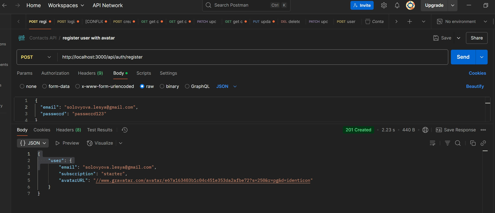
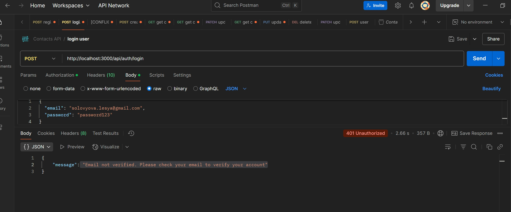
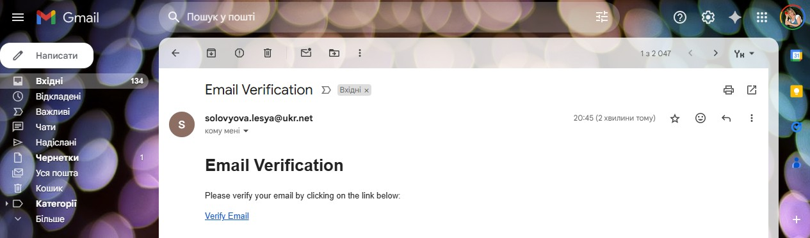
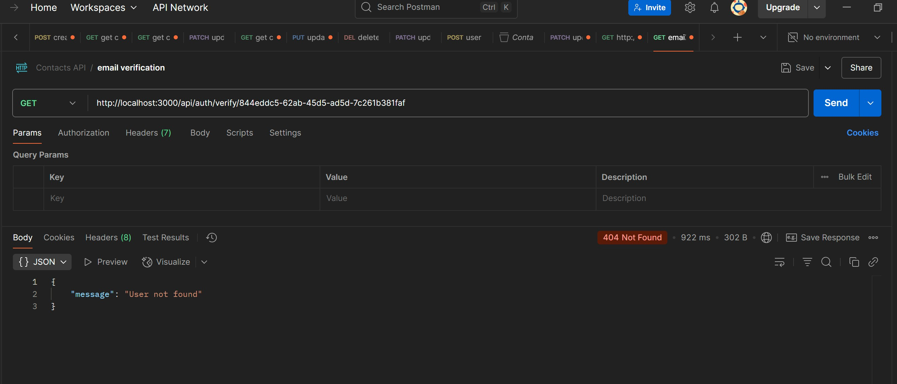
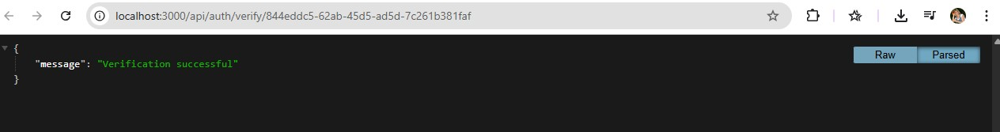
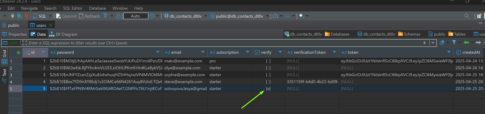
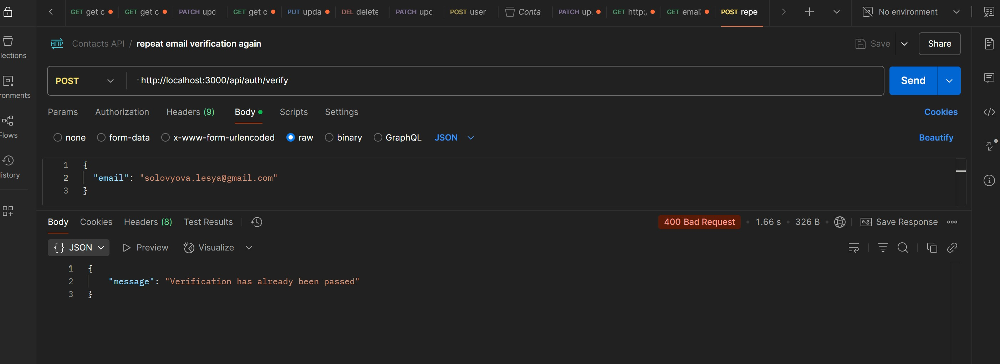

# HW-11 | Email Verification for Contacts API
# Email Verification for Contacts API

This extension adds email verification functionality to the Contacts API project.

## Feature Description

After registration, users receive an email with a verification link to confirm their email address. This provides an additional security layer and confirms that the email address belongs to the user.

## New API Routes

### Email Verification

```
GET /api/auth/verify/:verificationToken
```

- Verifies a user's email address using a unique token
- Returns a 200 status and success message upon successful verification
- Returns a 404 error when attempting to verify the same token again

### Resending Verification Email

```
POST /api/auth/verify
```

**Request body:**
```json
{
  "email": "user@example.com"
}
```

- Sends a new verification email to the specified address
- Returns a 400 error if the email is already verified
- Returns a 400 error if the email field is missing from the request

## Updated User Model

Two new fields have been added to the `User` model:

- `verify` (BOOLEAN) - flag indicating whether the email is verified
- `verificationToken` (STRING) - unique token for verification

## Email Configuration

Add the following variables to your .env file:

```
UKR_NET_EMAIL=your_email@ukr.net
UKR_NET_PASSWORD=your_password
BASE_URL=http://localhost:3000
```

## Installation and Setup

1. Clone the repository
2. Install dependencies: `npm install`
3. Create a .env file with the necessary environment variables
4. Start the server: `npm start`

## New Dependencies

- `nodemailer` - for sending emails
- `uuid` - for generating unique verification tokens

## Email Verification Workflow

1. User registers by providing an email and password
2. System creates a unique verification token and sends it to the provided email
3. User receives the email and clicks the verification link
4. System validates the token, marks the email as verified, and removes the token
5. User can now log in (login is not possible before verification)

## Changes to Login Process

Now when attempting to log in, the system checks if the email is verified. If not, a 401 error is returned with a message about the need for verification.

## Testing the API

You can use Postman for testing:

1. Register a new user
2. Try to log in (should get an error about unverified email)
3. Check your email and follow the verification link
4. Try to log in again (should succeed)
5. Try to verify the same email again (should get a 404 error)

## API Testing Results in Postman

All API endpoints were tested using Postman. Here are the results with screenshots:

### Authentication with email verification

#### User Registration with email verification
- **Endpoint**: POST /api/auth/register



#### Login with not verified email
- **Endpoint**: POST /api/auth/login



#### Email with verification request


#### Verification error with the same token


#### Verification successful message


#### Data base table user with verified email status


#### Verification email request for already verified user
