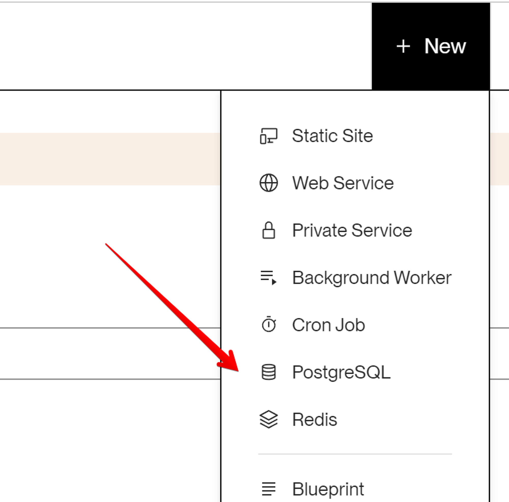
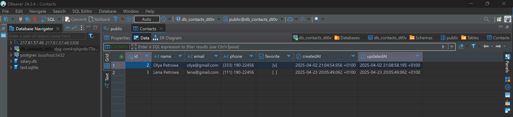

# HW-3 | PostgreSQL and Sequelize

Create a branch called 03-postgresql from the master branch.

Continue developing the REST API for working with a contacts collection.

## Step 1

Create an account on Render. Then create a new PostgreSQL database in your account, which should be named db-contacts.



## Step 2

Install the pgAdmin graphical editor for convenient work with the PostgreSQL database. Connect to the created cloud database through the graphical editor and create a contacts table.

## Step 3

Use the source code from homework #2 and replace the storage of contacts from a JSON file with the database you created.

Write code to create a connection to PostgreSQL using Sequelize.
Upon successful connection, print the message "Database connection successful" to the console.
Be sure to handle connection errors. Print an error message to the console and terminate the process using process.exit(1).
In the request processing functions, replace the CRUD operations code for contacts from the file with Sequelize methods for working with the contacts collection in the database.

Sequelize model for contacts:

```javascript
const Contact = sequelize.define(
  'contact', {
    name: {
      type: DataTypes.STRING,
      allowNull: false,
    },
    email: {
      type: DataTypes.STRING,
      allowNull: false,
    },
    phone: {
      type: DataTypes.STRING,
      allowNull: false,
    },
    favorite: {
      type: DataTypes.BOOLEAN,
      defaultValue: false,
    },
  }
```

## Step 4

We have added a favorite status field to contacts that takes a boolean value of true or false. It indicates whether the specified contact is in favorites or not. You need to implement a new router to update the contact status:

PATCH /api/contacts/:contactId/favorite

Receives the contactId parameter
Receives a body in JSON format with an update to the favorite field
If everything is fine with the body, calls the updateStatusContact(contactId, body) function (write it) to update the contact in the database
Based on the function result, returns the updated contact object and status 200. Otherwise, returns JSON with the key {"message":"Not found"} and status 404

## Acceptance Criteria

- Repository with the homework has been created
- Link to the repository has been sent to the mentor for review
- The code meets the project's technical requirements
- The code has no commented-out sections
- The project works correctly with the current LTS version of Node

## Submission Format

- The homework contains a link to the code repository
- The repository file is attached in zip format.
☝ IMPORTANT
Review the instructions for uploading the working file from the Github repository

## Grading Format

Score from 0 to 100

## Point Distribution

Total maximum - 100 points

### Step 2 — 10 points

- Successful installation of the DBeaver or pgAdmin graphical editor
- Successful connection to the cloud database through DBeaver or pgAdmin
- Correct creation of the contacts table

### Step 3 — 75 points

1. Creating a connection to PostgreSQL using Sequelize - 10 points
   - Writing code to connect to the database
   - Printing the message "Database connection successful" upon successful connection

2. Handling connection errors - 5 points
   - Correct handling of connection errors
   - Printing an error message to the console and terminating the process using process.exit(1)

3. CRUD operations using Sequelize - 60 points
   - Replacing CRUD operations code for contacts from the file with Sequelize methods in all request processing functions:
     - listContacts (5 points)
     - getContactById (5 points)
     - removeContact (5 points)
     - addContact (5 points)
     - updateContact (10 points)

### Step 4 — 15 points

1. Creating a PATCH /api/contacts/favorite route
   - Implementation of the new router
   - Receiving the contactId parameter and body in JSON format with an update to the favorite field

2. The updateStatusContact function
   - Writing the updateStatusContact(contactId, body) function to update the contact in the database
   - Correct updating of the contact status in the database using Sequelize

3. Handling results
   - Returning the updated contact object and status 200 on successful update
   - Returning JSON with the key {"message":"Not found"} and status 404 if the contact is not found

## Evaluation Details:

- Step 2 is evaluated based on successful installation, connection, table creation, and data import.
- Step 3 includes creating a database connection, error handling, and replacing CRUD operations with Sequelize methods.
- Step 4 includes implementing a new router, writing a function to update the contact status, and handling results.


Points may be deducted for incorrectly implemented items listed above:
- Critical error - minus 5 points
- Minor error - minus 2 points

 ---

# TASK'S RESULTS

