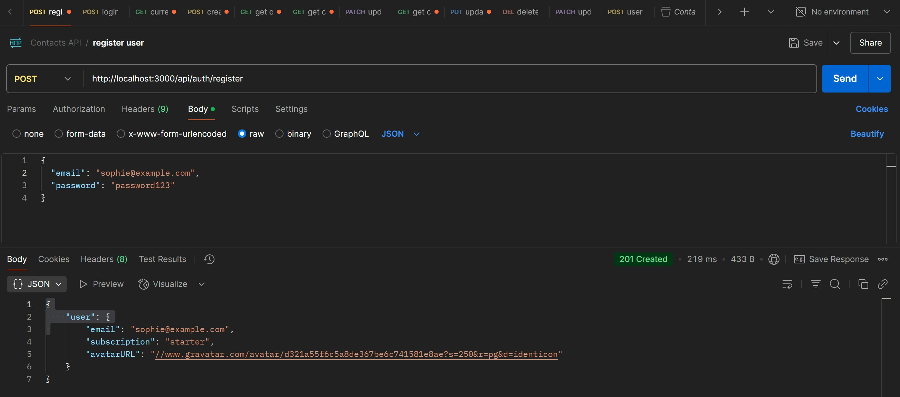
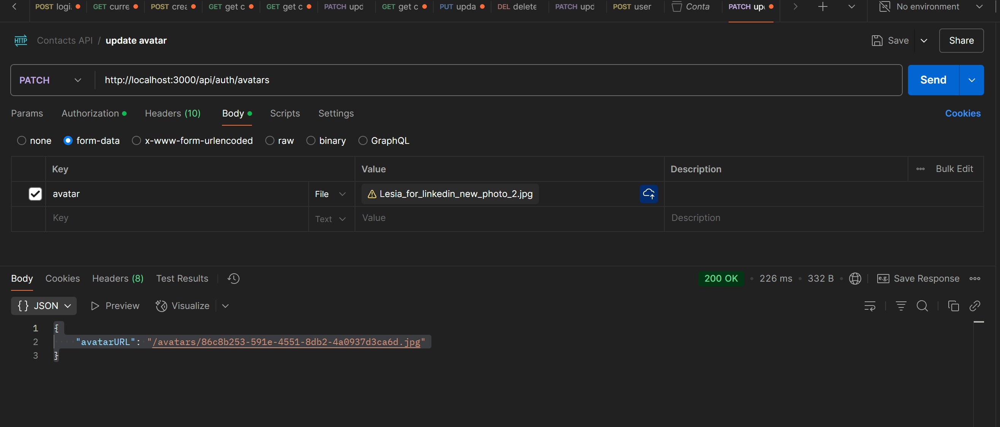
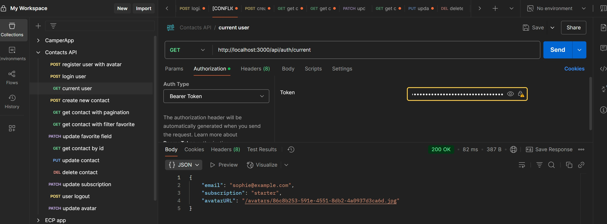

# HW-8 | File Processing | Contacts Manager API with Avatar Support

An improved version of our contact management API that now lets users upload and manage their profile pictures.

## What's New
We've added several features to handle user photos:
* Users can upload their own profile pictures
* New users get automatic profile pictures using Gravatar
* Profile pictures are shown in user data responses
* Images are safely stored and easily accessed
* Users can update their profile picture anytime

## New Technologies
* **multer:** Handles file uploads
* **sharp:** Makes images the right size
* **gravatar:** Creates default profile pictures
* **fs/promises:** Manages files
* **path:** Handles file locations
* **uuid:** Creates unique filenames

## How Files Are Stored
* **temp/:** Temporary storage for new uploads
* **public/avatars/:** Permanent storage for profile pictures
* Each file gets a unique name to avoid conflicts

## New API Endpoint
**PATCH /api/auth/avatars**
* **What it does:** Updates your profile picture
* **What to send:** A form with an 'avatar' field containing your image file
* **Required:** Authentication token
* **What you get back:** The URL to your new profile picture
* **Possible errors:** 400 Bad Request, 401 Unauthorized

## How Profile Pictures Work
1. You upload an image through the API
2. The system checks if it's a valid image
3. The image gets a unique name
4. The image is resized to 250×250px
5. The image is saved to the avatars folder
6. Your user record is updated with the new image path
7. You receive the path to your new profile picture

## Security Measures
* Only image files are accepted
* Files can't be larger than 2MB
* Only logged-in users can update their own pictures
* Filenames are randomly generated for security

## Code Examples
**Upload Setup**

```javascript
import multer from "multer";
import path from "path";

// Where to store uploaded files temporarily
const tempDir = path.join(process.cwd(), "temp");

const multerConfig = multer.diskStorage({
 destination: tempDir,
 filename: (req, file, cb) => {
   cb(null, file.originalname);
 },
});

// Make sure the file is an image
const fileFilter = (req, file, cb) => {
 if (file.mimetype.startsWith("image/")) {
   cb(null, true);
 } else {
   cb(new Error("Please upload only image files."), false);
 }
};

// Set up the upload middleware
const upload = multer({
 storage: multerConfig,
 fileFilter,
 limits: {
   fileSize: 2 * 1024 * 1024, // 2MB size limit
 },
});

```

## API Testing Results in Postman

All API endpoints were tested using Postman. Here are the results with screenshots:

### Authentication

#### User Registration with avatar

- **Endpoint**: POST /api/auth/register



#### Update user avatar


#### Get Current User with avatar
- **Endpoint**: GET /api/auth/current

