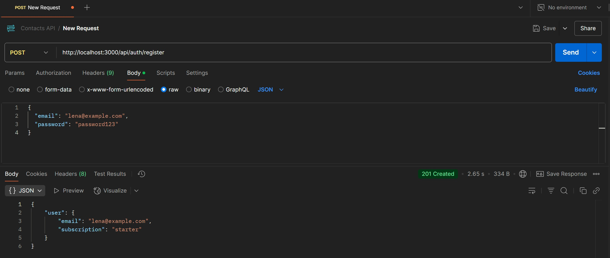
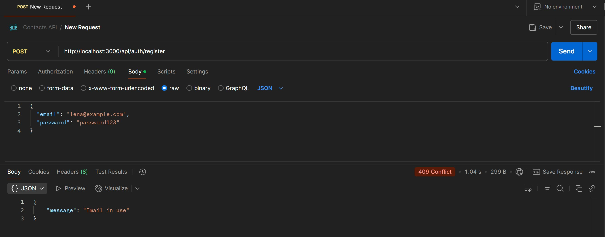
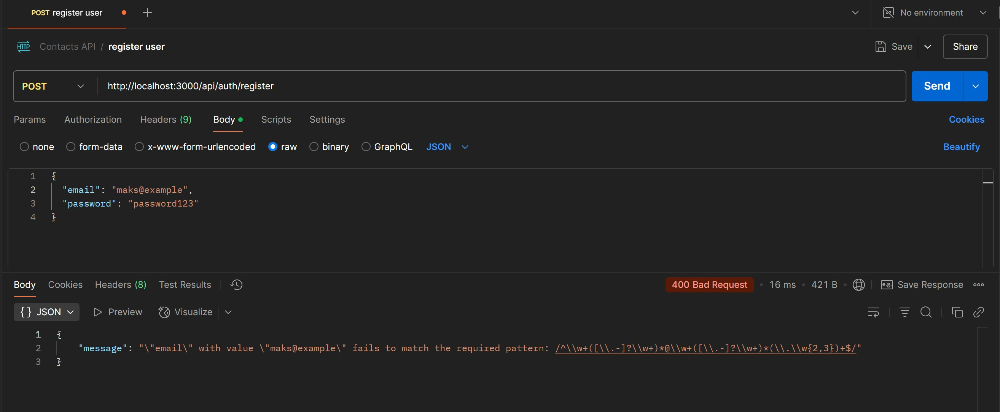
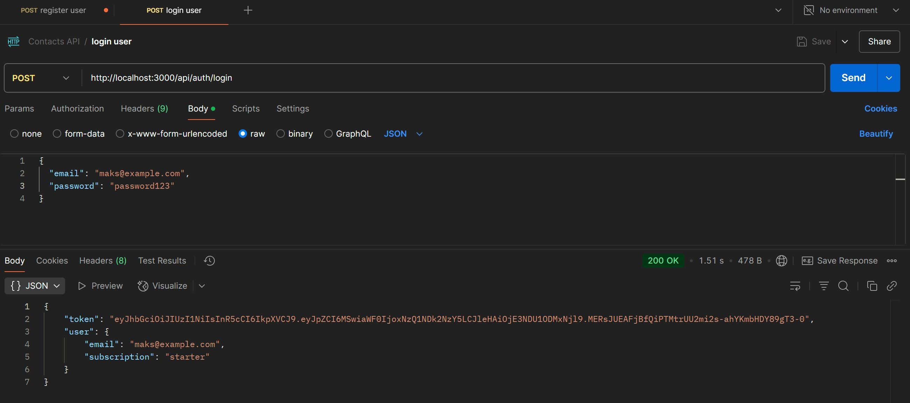
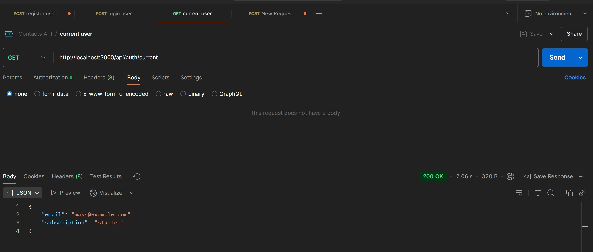
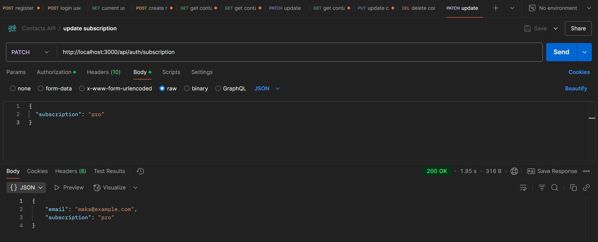
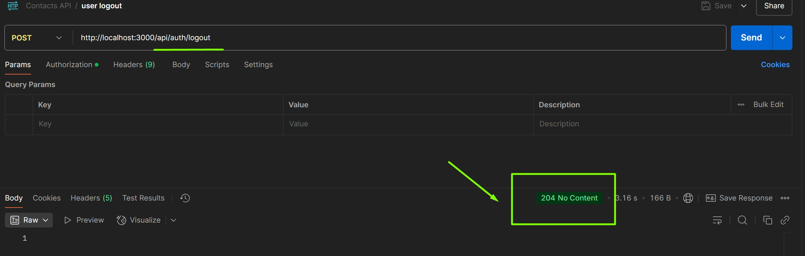
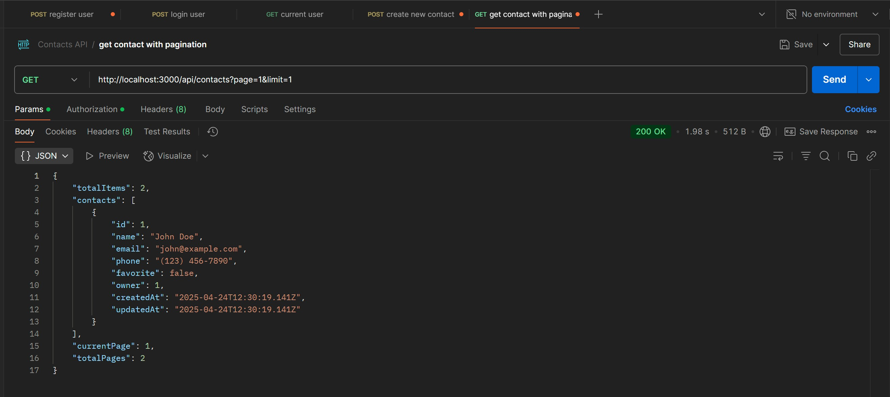
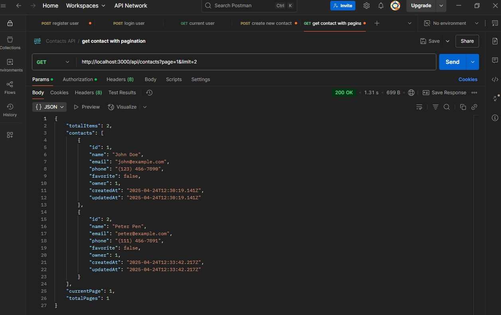
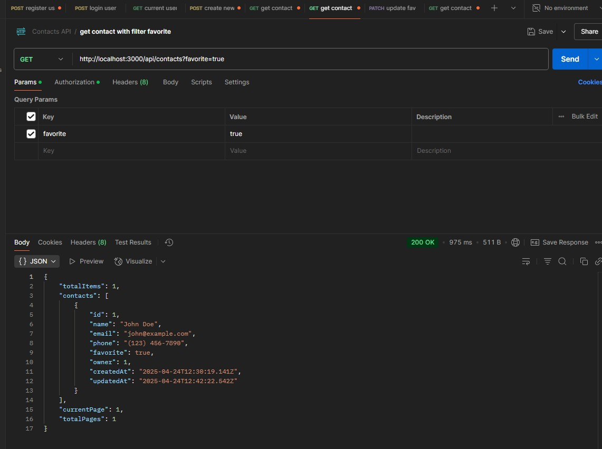

# HW-5

# Contacts REST API

A RESTful API for contacts management with authentication built using Node.js, Express, PostgreSQL, and Sequelize.

## Features

- User registration and authentication with JWT
- CRUD operations for contacts
- Contact filtering by favorite status
- Pagination for contacts list
- User subscription management

## Prerequisites

- Node.js (LTS version)
- PostgreSQL database (hosted on Render.com)
- DBeaver or pgAdmin for database management

## Project Setup

### 1. Clone the repository
```bash
git clone <repository-url>
cd goit-node-rest-api
```

### 2. Install dependencies
```bash
npm install
```

### 3. Set up PostgreSQL Database on Render.com

1. Create an account on [Render.com](https://render.com) if you don't have one yet
2. From the Render dashboard, click on "New +" and select "PostgreSQL"
3. Configure your database:
   - Give it a name (e.g., "db-contacts")
   - Choose the free plan for development
   - Select a region closest to you
   - Click "Create Database"
4. After creation, Render will provide you with database credentials:
   - Database name
   - Internal Database URL
   - External Database URL
   - Username
   - Password
   - Host
   - Port (usually 5432)
5. Save these credentials for the next steps

### 4. Connect to the database using DBeaver

1. Download and install [DBeaver](https://dbeaver.io/) if you haven't already
2. Open DBeaver and click on "New Database Connection"
3. Select "PostgreSQL" and click "Next"
4. Enter the connection details from Render.com:
   - Host: The hostname from Render (e.g., `dpg-xxxx-a.oregon-postgres.render.com`)
   - Port: 5432 (default) or the port provided by Render
   - Database: The database name from Render
   - Username: The username from Render
   - Password: The password from Render
5. On the "PostgreSQL" tab, check "Use SSL" and select "Require" from the dropdown
6. Test the connection by clicking on "Test Connection..." button
7. If the connection is successful, click "Finish"

### 5. Create database tables

You have two options to create the necessary database tables:

#### Option A: Automatic table creation using Sequelize sync()

1. In your model files (`db/models/User.js` and `db/models/Contact.js`), uncomment the following lines:
```javascript
// In User.js
User.sync({alter: true});

// In Contact.js
Contact.sync({alter: true});
```

2. Start your application. Sequelize will automatically create or update the tables based on your model definitions.

#### Option B: Manual table creation using DBeaver

1. Connect to your database in DBeaver
2. Right-click on the database name and select "SQL Editor" > "New SQL Script"
3. Create the users table:
```sql
CREATE TABLE users (
   id SERIAL PRIMARY KEY,
   password VARCHAR(255) NOT NULL,
   email VARCHAR(255) NOT NULL UNIQUE,
   subscription VARCHAR(10) DEFAULT 'starter',
   token VARCHAR(255),
   "createdAt" TIMESTAMP WITH TIME ZONE NOT NULL,
   "updatedAt" TIMESTAMP WITH TIME ZONE NOT NULL
);
```
4. Create the contacts table:
```sql
CREATE TABLE contacts (
   id SERIAL PRIMARY KEY,
   name VARCHAR(255) NOT NULL,
   email VARCHAR(255) NOT NULL,
   phone VARCHAR(255) NOT NULL,
   favorite BOOLEAN DEFAULT false,
   owner INTEGER NOT NULL REFERENCES users(id) ON DELETE CASCADE,
   "createdAt" TIMESTAMP WITH TIME ZONE NOT NULL,
   "updatedAt" TIMESTAMP WITH TIME ZONE NOT NULL
);
```
5. Execute the queries by clicking the "Execute SQL Script" button

### 6. Configure environment variables
Create a `.env` file in the root directory with the following variables (using the Render.com database credentials):
```
DATABASE_DIALECT=postgres
DATABASE_USERNAME=your_username_from_render
DATABASE_PASSWORD=your_password_from_render
DATABASE_HOST=your_host_from_render
DATABASE_NAME=your_database_name_from_render
DATABASE_PORT=5432
JWT_SECRET=your_secret_key
PORT=3000
```

### 7. Run the application
```bash
# Development mode with nodemon
npm run dev

# Production mode
npm start
```

## API Testing Results in Postman

All API endpoints were tested using Postman. Here are the results with screenshots:

### Authentication

#### User Registration

- **Endpoint**: POST /api/auth/register



#### Email Already Used Error


#### Invalid Email Format



#### User Login

- **Endpoint**: POST /api/auth/login



#### Get Current User
- **Endpoint**: GET /api/auth/current


#### Update Subscription
- **Endpoint**: PATCH /api/auth/subscription


#### User Logout
- **Endpoint**: POST /api/auth/logout


### Contacts Management

#### Get All Contacts with Pagination
- **Endpoint**: GET /api/contacts?page=1&limit=1

- **Endpoint**: GET /api/contacts?page=1&limit=2


#### Filter Contacts with favorite status
- **Endpoint**: GET /api/contacts?favorite=true
